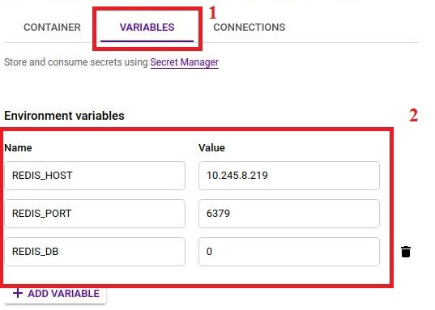

<div style="position: absolute; top: 0px; right: 0px;">
    
</div>

<div style="height: 150px"></div>

# Basic Redis Caching Demo Spring (Java) 

This app returns the number of repositories a Github account has. When you first search for an account, the server calls Github's API to return the response. This can take 100s of milliseconds. The server then adds the details of this slow response to Redis for future requests. When you search again, the next response comes directly from Redis cache instead of calling Github. The responses are usually usually in a millisecond or so making it blazing fast.


# Overview video

Here's a short video that explains the project and how it uses Redis: 

[](https://youtube.com/watch?v=x4dwTM97tBM)

## Try it out
<p>
    <a href="https://heroku.com/deploy" target="_blank">
        
    <a>
</p>

<p>
    <a href="https://deploy.cloud.run?dir=server" target="_blank">
        
    </a>
    (See notes: How to run on Google Cloud)
</p>


## How to run on Google Cloud

<p>
    If you don't have redis yet, plug it in  (https://spring-gcp.saturnism.me/app-dev/cloud-services/cache/memorystore-redis).
    After successful deployment, you need to manually enable the vpc connector as shown in the pictures:
</p>

1. Open link google cloud console.


2. Click "Edit and deploy new revision" button.


3. Add environment.



4.  Select vpc-connector and deploy application.


<a href="https://github.com/GoogleCloudPlatform/cloud-run-button/issues/108#issuecomment-554572173">
Problem with unsupported flags when deploying google cloud run button
</a>

---
# How it works?
## 1. How the data is stored:
<ol>
     <li>New repos are added:<pre>SETEX github_username timeout amount_of_repositories
Example: SETEX redis 3600 14</pre> 
<a href="https://redis.io/commands/setex">
more information</a>
</li>
</ol>

## 2. How the data is accessed:
<ol>
    <li> Get cache (Don't think about cache's timeout): <pre>GET github_username
Example: GET redis</pre>
<a href="https://redis.io/commands/get">
more information</a>
</li>

</ol>
  
---

## How to run it locally?


### Run docker compose or install redis manually

Install docker (on mac: https://docs.docker.com/docker-for-mac/install/)

```sh
docker network create global
docker-compose up -d --build
```

#### Open directory server (cd server): copy .env.example to create .env (copy .env.example .env  or cp .env.example .env). And provide the values for environment variables (if needed)
   	- REDIS_URL: Redis server url
    - REDIS_HOST: Redis server host
	- REDIS_PORT: Redis server port
	- REDIS_DB: Redis server db index
	- REDIS_PASSWORD: Redis server password

#### Run backend

Install gradle (Use Gradle 6.3 or later) (on mac: https://gradle.org/install/) 


Install JDK (use 8 or later version) (on mac: https://docs.oracle.com/javase/10/install/installation-jdk-and-jre-macos.htm)

``` sh
cd server
export $(cat .env | xargs)
./gradlew build
./gradlew run
```

#### Run frontend

Static сontent runs automatically with the backend part. In case you need to run it separately, please see README in the [client](client) folder

